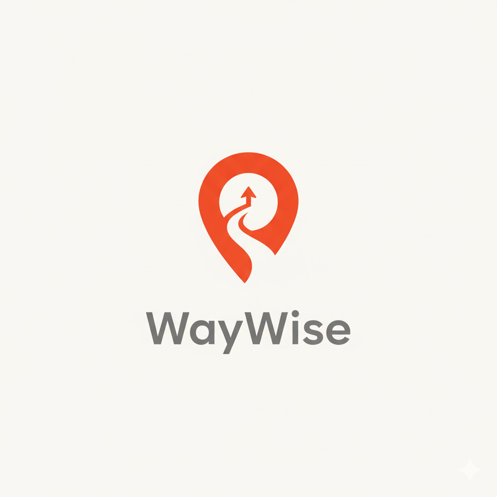
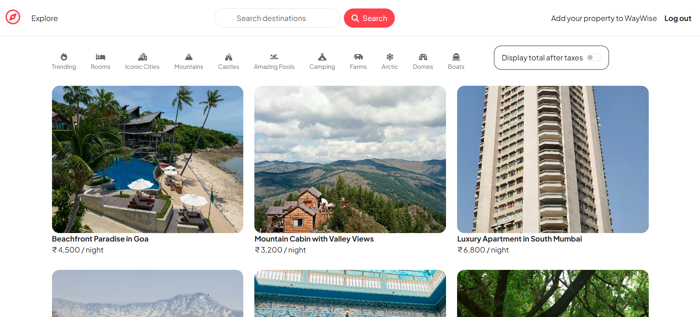
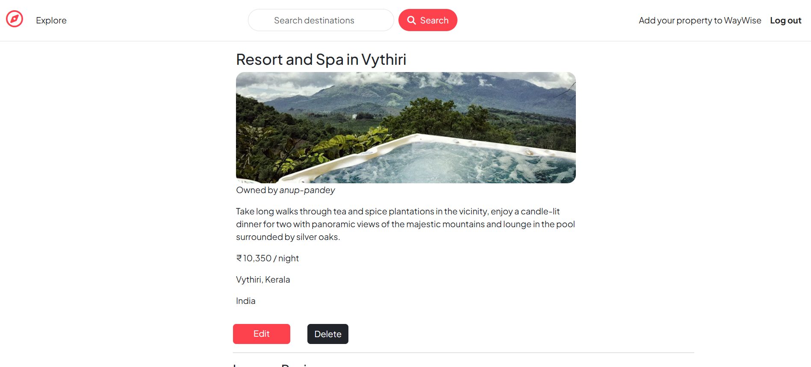
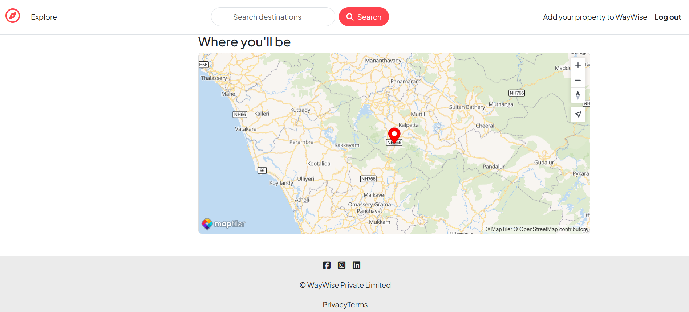
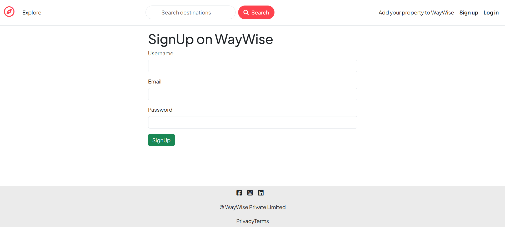

<p align="center">
  
</p>

<h1 align="center">🌍 WayWise – Discover Smart Listings</h1>

<p align="center">
  <b>Smart listings for smarter travelers.</b><br>
  Explore unique stays, rentals, and experiences across the globe with <b>WayWise</b> — a modern Airbnb-inspired web app built with <b>Node.js</b>, <b>Express</b>, <b>MongoDB Atlas</b>, <b>Cloudinary</b>, and <b>MapTiler</b>.
</p>

<p align="center">
  <a href="https://waywise.onrender.com" target="_blank">
    
  </a>
  
  
  
  
  
  
  
  <a href="./LICENSE">
    
  </a>
</p>

---

<p align="center">
  
</p>

---

## 🚀 Live Demo  
🌐 **Live Website:** [https://waywise.onrender.com](https://waywise.onrender.com)

---

## 🧠 About the Project

**WayWise** is a full-stack travel listings platform that allows users to discover, add, and review properties worldwide.

With a modern UI and powerful backend, it provides:
- 🏠 Seamless property creation and management  
- 🗺️ Real-time map locations using MapTiler  
- ☁️ Cloud-based image uploads via Cloudinary  
- 🔐 Secure user authentication with Passport.js  
- ⭐ User reviews and ratings  
- 🧭 Intuitive filtering and search  

Inspired by **Airbnb**, built for learners and developers to understand **real-world full-stack architecture**.

---

## 🏗️ Tech Stack

| Category | Technologies |
|-----------|---------------|
| **Frontend** | EJS, Bootstrap 5, Vanilla JS, Font Awesome |
| **Backend** | Node.js, Express.js |
| **Database** | MongoDB Atlas (Mongoose ODM) |
| **Authentication** | Passport.js (Local Strategy) |
| **File Uploads** | Cloudinary + Multer |
| **Maps & Geocoding** | MapTiler SDK & API |
| **Validation** | JOI Schema Validation |
| **Deployment** | Render (Server) + MongoDB Atlas (Database) |

---

## 🌟 Key Features

### 🏡 Listings
- Add, view, edit, and delete property listings  
- Upload images directly to **Cloudinary**
- Categorize listings (Rooms, Mountains, Castles, etc.)
- Automatically geocode and map locations using **MapTiler**

### ⭐ Reviews
- Authenticated users can create and delete reviews  
- Star ratings styled with **Starability CSS**

### 👥 Authentication
- Secure signup/login using **Passport Local**
- Flash messages for real-time feedback
- Redirects to the original page after login

### 🗺️ Interactive Maps
- Integrated **MapTiler SDK**
- Dynamic map rendering with popups and markers

### 💾 Sessions
- Sessions stored in **MongoDB** via `connect-mongo`
- `httpOnly` secure cookies

### 🎨 Responsive UI
- Built using **Bootstrap 5** and **Plus Jakarta Sans**
- Category icons, filters, and modern cards layout

---

## 🧰 Project Structure

```bash
WayWise/
│
├── app.js                     # Main Express App Entry
├── cloudConfig.js             # Cloudinary Configuration
├── middleware.js              # Custom Middleware (Auth, Validation)
├── schema.js                  # JOI Validation Schemas
│
├── models/                    # Mongoose Schemas
│   ├── listing.js
│   ├── review.js
│   └── user.js
│
├── routes/                    # Express Routers
│   ├── listing.js
│   ├── review.js
│   └── user.js
│
├── controllers/               # MVC Controllers
│   ├── listings.js
│   ├── reviews.js
│   └── users.js
│
├── public/
│   ├── css/
│   │   ├── style.css
│   │   ├── rating.css
│   │   └── search.css
│   ├── js/
│   │   ├── script.js
│   │   ├── filter.js
│   │   └── map.js
│   ├── images/
│   │   └── waywise-logo.png
│   └── screenshots/           # Project Screenshots
│       ├── home.png
│       ├── listing1.png       # Listing details
│       ├── listing2.png       # Review section
│       ├── listing3.png       # Map section
│       └── signup.png         # Signup page
│
├── utils/                     # Helper Utilities
│   ├── ExpressError.js
│   └── wrapAsync.js
│
├── views/                     # EJS Templates
│   ├── layouts/
│   │   └── boilerplate.ejs
│   ├── includes/
│   │   ├── navbar.ejs
│   │   ├── footer.ejs
│   │   └── flash.ejs
│   ├── listings/
│   │   ├── index.ejs
│   │   ├── show.ejs
│   │   ├── edit.ejs
│   │   └── new.ejs
│   ├── users/
│   │   ├── login.ejs
│   │   └── signup.ejs
│   └── error.ejs
│
├── .env                       # Environment Variables
├── package.json
└── README.md
```

---

## ⚙️ Environment Variables

Create a `.env` file in your project root and add:

```bash
ATLASDB_URL=<your_mongodb_atlas_connection_string>
SECRET=<any_random_secret>
CLOUD_NAME=<your_cloudinary_name>
CLOUD_API_KEY=<your_cloudinary_api_key>
CLOUD_API_SECRET=<your_cloudinary_api_secret>
MAPTILER_API_KEY=<your_maptiler_api_key>
NODE_ENV=development
```

---

## 🧩 Installation & Setup

### 1️⃣ Clone this repository
```bash
git clone https://github.com/<your-username>/WayWise.git
cd WayWise
```

### 2️⃣ Install dependencies
```bash
npm install
```

### 3️⃣ Configure environment variables
Add the `.env` file (as shown above).

### 4️⃣ Start the server
```bash
node app.js
```

App runs on → [http://localhost:3000](http://localhost:3000)

---

## ☁️ Deployment

WayWise is deployed using:

- 🌐 **Render:** Node.js Hosting  
- 🗄️ **MongoDB Atlas:** Cloud Database  
- ☁️ **Cloudinary:** Image Storage  
- 🗺️ **MapTiler:** Geocoding and Map Rendering  

You can easily deploy your own copy using **Render** or **Railway** by linking your GitHub repo and setting up your `.env` variables.

---

## 📸 Screenshots

### 🏠 Home Page
<p align="center">
  
</p>

---

### 🗺️ Listing Details Page
<p align="center">
  
</p>

### ⭐ Review Section
<p align="center">
  
</p>

### 🗾 Map Section
<p align="center">
  
</p>

---

### 📝 User Signup Page
<p align="center">
  
</p>


---

## 🧑‍💻 Author

**👤 Anup Pandey**  
💼 [LinkedIn](https://www.linkedin.com/in/anup-pandey-/)  
📸 [Instagram](https://www.instagram.com/ansh.__pvt__/)  
🌍 [Live Project](https://waywise.onrender.com)

---

## 🪪 License

This project is licensed under the **MIT License**.  
See the [LICENSE](./LICENSE) file for details.

---

## ⭐ Support

If you liked this project, please give it a ⭐ on GitHub!  
It helps others discover it and keeps the project growing.

---

<p align="center">
  Made with ❤️ by <b>Anup Pandey</b> using Node.js, Express, and MongoDB.
</p>

